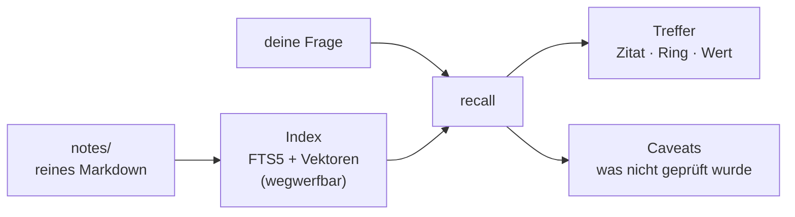

<div align="center">


# Cyberbrain

**Zitiertes, vertrauensgestuftes, lokales Gedächtnis für KI-Coding-Agenten.**

[](https://github.com/bassprofressor-lab/cyberbrain/actions/workflows/ci.yml)
[](https://crates.io/crates/cyberbrain)
[](LICENSE.md)
[](rust-toolchain.toml)
[](#installieren)
[](#für-die-eu-gebaut-abschaltbar)

[English](README.md) · **Deutsch**

[Installieren](#installieren) · [Fünf Minuten](#fünf-minuten) · [Wie es arbeitet](#wie-es-arbeitet) ·
[Was es braucht](#was-es-braucht) · [Compliance](#für-die-eu-gebaut-abschaltbar) ·
[Spezifikation](docs/SPEC.md) · [Changelog](CHANGELOG.md) · [Mitarbeiten](CONTRIBUTING.md)

</div>

Eine native Binärdatei. Deine Notizen bleiben reines Markdown, lesbar, editierbar, greppbar.
Nichts verlässt den Rechner, außer du sagst es, und jeder Weg, auf dem etwas hinaus könnte,
steht an einer Stelle, die du dir ausdrucken lassen kannst.


<sub>Eine Frage in den Worten, die du Monate später benutzen würdest. Jeder Treffer trägt den
Ring, aus dem er kommt, ein Zitat, das auf den Block zurückführt, und seinen Wert. Die
Screenshots stammen aus einem Demo-Store, die Notizen darin sind erfunden.</sub>

```console
$ cyberbrain recall 'postgres data directory'
1. r2-867ef2a8cd01  r2  pg18-moves-pgdata  (100% of top)
     # PostgreSQL 18 moves PGDATA
     The official `postgres:18` image puts the data directory at
     `/var/lib/postgresql/18/docker` instead of `/var/lib/postgresql/data` ...
caveat: contradiction check skipped: no inference model is configured
```

Die letzte Zeile ist genauso der Punkt wie der Treffer selbst. Das Werkzeug sagt, was es
**nicht** geprüft hat.

## Installieren

```console
$ cargo install cyberbrain
$ cyberbrain init
```

Oder eine fertige Binärdatei aus dem [letzten Release](https://github.com/bassprofressor-lab/cyberbrain/releases/latest)
nehmen und gegen die danebenliegende `SHA256SUMS` nachrechnen:

```console
$ sha256sum -c SHA256SUMS
$ ./cyberbrain-linux-x86_64 init
```

Linux und Windows. Zur Laufzeit braucht die Binärdatei nichts weiter: kein SQLite aus dem
System, kein OpenSSL, keinen Modellserver, kein node.

<details>
<summary>Ohne Weboberfläche, oder aus einem Checkout</summary>

<br>

Die Oberfläche ist in die Binärdatei kompiliert und liegt im Paket, die normale Installation
braucht deshalb keine node-Toolchain. Wer sie nicht mitschleppen will, lässt sie weg; CLI,
Hooks, MCP-Server und HTTP-API bleiben davon unberührt, und `serve` beantwortet die API und
sagt dazu, dass die Seite nicht mit eingebaut wurde:

```console
$ cargo install cyberbrain --no-default-features
```

Aus einem Checkout ist die Seite nicht verpackt, sondern wird gebaut, also zuerst bauen:

```console
$ git clone https://github.com/bassprofressor-lab/cyberbrain && cd cyberbrain
$ (cd ui && npm ci && npm run build)
$ cargo install --path crates/cyberbrain
```

</details>

## Fünf Minuten

```console
$ cyberbrain init
$ cyberbrain write --ring 2 --kind bug --name pg18-moves-pgdata --body 'was du gelernt hast'
$ cyberbrain scan
$ cyberbrain recall 'was du gelernt hast'
```

Vier Wege hinein, alle aus derselben Binärdatei:

| | |
|---|---|
| `cyberbrain <befehl>` | alles ist von der Kommandozeile aus erreichbar, überall mit `--json` |
| `cyberbrain hook <ereignis>` | sechs Lebenszyklus-Ereignisse des Agenten; gemessenes p99 von 4 ms inklusive Prozessstart, bei einem Budget von 15 ms |
| `cyberbrain mcp` | Model Context Protocol über stdio, für jeden Client, der es spricht |
| `cyberbrain serve` | Weboberfläche und HTTP-API, auf Loopback, ohne Anmeldung, weil nichts davon den Rechner verlässt |

## Wie es arbeitet



Die Notizen sind die Wahrheit und bleiben deine: eine Markdown-Datei je Notiz, im Repository,
lesbar auch ohne dieses Werkzeug. Der Index ist abgeleitet und darf jederzeit gelöscht werden,
`cyberbrain scan` baut ihn neu. Gesucht wird lexikalisch und semantisch zugleich, SQLite FTS5
für die Wörter und ein flacher Kosinus-Durchlauf über lokale Einbettungen für die Bedeutung,
zu einer Rangfolge verschmolzen.

### Drei Eigenschaften, die ein Gedächtnis vertrauenswürdig halten

**Zitiert.** Jede gefundene Aussage trägt eine Kennung, die auf genau den Quellblock
zurückführt. `cyberbrain recall --id r2-867ef2a8cd01` klappt ihn auf. Eine Antwort ohne Zitat
ist ein Fehler, kein schlechteres Ergebnis.

**Vertrauensgestuft.** Notizen liegen in nummerierten Ringen. Ring 0 hält die Invarianten des
Betreibers und überstimmt alles, Ring 4 ist ungeprüftes Material. Ring 0 und 1 werden in jede
Sitzung eingespeist, mit Obergrenze, damit das bezahlbar bleibt. Widersprechen sich zwei
Blöcke, gewinnt der niedrigere Ring, und der Konflikt wird gemeldet statt still aufgelöst.

**Lokal zuerst.** Die Einbettungen werden auf deinem Rechner gerechnet. Der Kern macht
überhaupt kein Netzwerk-I/O. Inferenz ist optional und läuft gegen jeden OpenAI-kompatiblen
Endpunkt, also Ollama, LM Studio, llama.cpp, oder NVIDIA PAIR, das die Arbeit über eine
RTX-Maschine, einen DGX Spark und einen Apple M4 Mac verteilt.

<details>
<summary>Was die Weboberfläche zeigt (Screenshots)</summary>

<br>

**Status** — was der Store hält, was der Index weiß, welches Modell geladen ist, und eine
Tafel, die aufzählt, was die Seite *nicht* messen kann.


**Graph** — Notizen und die Verweise dazwischen, nach Ring. Ein Verweis auf eine Notiz, die
es noch nicht gibt, wird als Absicht gezeichnet, nicht als Fehler.


Die Seite ist in die Binärdatei kompiliert, spricht Deutsch und Englisch und holt nichts aus
dem Netz.

</details>

## Was es braucht

Einen Laptop. Es gibt hier kein großes Modell zu betreiben: die semantische Suche benutzt
**statische Einbettungen**, also ein Nachschlagen in einer Tabelle und einen Mittelwert statt
eines Vorwärtslaufs durch ein Netz. Deshalb reicht ein CPU-Kern, und deshalb ist die Datei auf
der Platte größer als die Arbeit, die sie macht: was da Platz braucht, ist Wortschatz, nicht
Rechenleistung.

| | ohne Modell | mit Einbettungsmodell |
|---|---|---|
| eine Suche | 10 ms | 2,3 s, das meiste davon Modell laden |
| Arbeitsspeicher | 14 MB | 1,55 GB Spitze, während die Suche läuft |
| Index komplett neu | 0,7 s | 4,0 s |
| auf der Platte | — | 507 MB für das Modell-Artefakt |

<sub>Gemessen am 06.09.2026 gegen einen echten Store mit 1.004 Notizen und 4.031 Blöcken, auf
einem Server ohne GPU (AMD EPYC-Milan, 12 vCPU, 23 GB RAM). Mit deinem Korpus kommen andere
Zahlen heraus, es geht um die Größenordnung.</sub>

Keine GPU, kein Modellserver, kein Konto, keine Cloud, und kein Download ohne deine
Zustimmung. Der einzige Teil, der sich bessere Hardware wünscht, ist die optionale
Widerspruchsprüfung: sie braucht einen Inferenz-Endpunkt, und auf diesem Server ohne GPU hat
eine Prüfung 126 s gedauert, über dem Budget von 3 s. Also kamen die Treffer ungeprüft
zurück, und haben das gesagt.

### Die semantische Suche braucht ein Modell, und sagt es, wenn sie keines hat

Ohne Zutun ist die Suche lexikalisch, und jedes Ergebnis sagt das als Caveat. Lexikalisch
heißt wörtlich: ohne Modell findet `postgres` kein `PostgreSQL`, und die Wörter, nach denen du
suchst, müssen im Absatz stehen. Für die semantische Suche legst du ein model2vec-Artefakt
unter `<store>/models/model2vec` ab, also `model.safetensors`, `tokenizer.json` und eine
`manifest.json` mit der blake3-Summe beider Dateien. Heruntergeladen wird nichts für dich,
außer du setzt `embedding.model_source` und `embedding.model_download_consent` in der Konfiguration,
und selbst dann passiert es einmal, über den einen registrierten Weg nach draußen.

## Für die EU gebaut, abschaltbar


<sub>Die Überschrift ist aus dem Ausgangsregister berechnet, nicht hingeschrieben. Darunter
steht, was das aktive Profil über die Rechtslage behauptet, mit dem Artikel, auf dem jede
Zeile ruht, und wie sicher sich der Autor ist.</sub>

Compliance ist ein Teilsystem, kein Abschnitt in der Dokumentation. `cyberbrain policy egress`
druckt jeden Weg, auf dem Bytes den Rechner verlassen können, was jeder trägt und ob er an
ist. Heute hat diese Liste zwei Einträge und endet mit „Telemetry does not exist."

- **Löschung, die löscht** (DSGVO Art. 17): `cyberbrain forget` entfernt die Notiz, ihre
  Blöcke, ihre Vektoren, ihre Indexzeilen und ihre Ableitungen in einer Transaktion und
  druckt, was weg ist.
- **Auskunft** (Art. 15): `cyberbrain policy subject <kennung>` gibt alles zurück, was zu ihr
  gespeichert ist, mit Zitaten.
- **Eine PII-Prüfung, bevor eine Notiz geschrieben wird**, die den Schreibvorgang für deine
  Entscheidung anhält, statt hinter deinem Rücken zu schwärzen.
- **Ein Audit-Log, an das nur angehängt wird**, mit blake3-Hashkette, und ein `verify`, das
  die erste veränderte Zeile benennt und mit einem Fehlercode endet.
- **Aufbewahrungsfristen** je Notiz, angewendet auf Anforderung und nie still im Hintergrund.
- **Ein Pflichtenkatalog**: `cyberbrain policy obligations` druckt, was das aktive Profil über
  die gesetzlichen Pflichten behauptet, jede Zeile mit Artikel und Sicherheitsgrad.

`policy.profile` ist `eu`, `ch` oder `off`. Die Schweiz ist ein eigenes Profil und nicht
„EU minus", weil das revidierte DSG inhaltlich abweicht und ein Zusammenlegen Aussagen
erzeugt, die in einem der beiden Länder falsch sind. Was nicht hoch eingestuft ist, steuert
kein Verhalten.

## Stand

**v0.1.0, und jung.** 447 Tests, sieben Pakete, clippy und rustfmt sauber. Auf crates.io
veröffentlicht, mit Binärdateien für Linux und Windows am Release. Gelaufen ist es gegen den
echten Korpus eines einzigen Betreibers, 1.086 Notizen über fünf Projekte, und sonst nicht
viel. Mit Kanten ist zu rechnen, melde sie.

Cyberbrain ist ein eigenständiges Werk. Es teilt keinen Quelltext mit irgendeinem anderen
Gedächtnis-Werkzeug; §0 von [`docs/SPEC.md`](docs/SPEC.md) hält die Grenze fest, unter der es
gebaut wurde, und die Commit-Historie belegt das Entscheidung für Entscheidung.

<details>
<summary>Die sieben Pakete</summary>

<br>

| Paket | was es ist |
|---|---|
| [`cyberbrain`](https://crates.io/crates/cyberbrain) | die Binärdatei: CLI, Hooks, MCP-Server, HTTP-API und die Weboberfläche |
| [`cyberbrain-core`](https://crates.io/crates/cyberbrain-core) | Store, Notizen, Ringe, Konfiguration, die Typen, auf die sich alles andere einigt |
| [`cyberbrain-index`](https://crates.io/crates/cyberbrain-index) | der wegwerfbare Index: FTS5, Vektoren, hybride Suche |
| [`cyberbrain-embed`](https://crates.io/crates/cyberbrain-embed) | statische Einbettungen, geladen aus einem hash-geprüften Artefakt |
| [`cyberbrain-code`](https://crates.io/crates/cyberbrain-code) | der Code-Index hinter `cyberbrain find` |
| [`cyberbrain-llm`](https://crates.io/crates/cyberbrain-llm) | der optionale OpenAI-kompatible Client |
| [`cyberbrain-policy`](https://crates.io/crates/cyberbrain-policy) | Ausgangsregister, Audit-Kette, PII-Gate, Profile, Pflichtenkatalog |

</details>

## Mitarbeiten und Sicherheit

[`CONTRIBUTING.md`](CONTRIBUTING.md) vor dem ersten Pull Request: die Clean-Room-Regel aus
SPEC §0 bindet auch Beitragende, und ein Beitrag, der sie bricht, bricht rückwirkend die
Herkunftsaussage weiter oben. Sicherheitslücken gehen über [`SECURITY.md`](SECURITY.md), nicht
über ein öffentliches Issue.

## Lizenz

[FSL-1.1-ALv2](LICENSE.md). Nutzbar für alles, außer um ein konkurrierendes Produkt zu bauen,
und jede Version wird zwei Jahre nach ihrem Erscheinen Apache-2.0. Copyright 2026 Krynex Labs.
