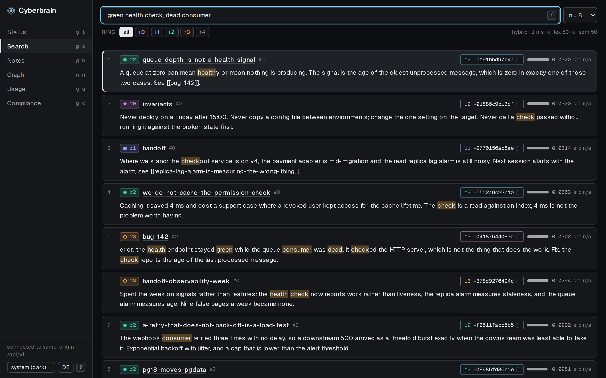
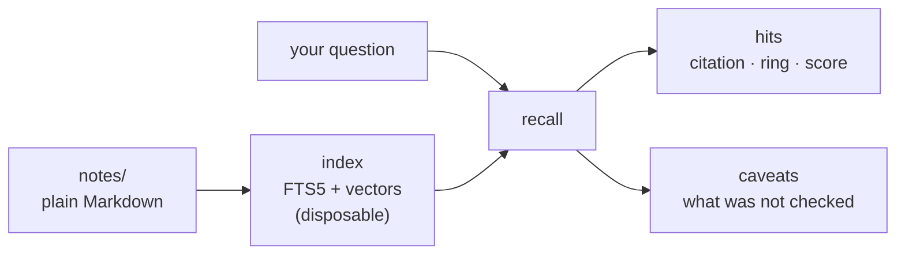
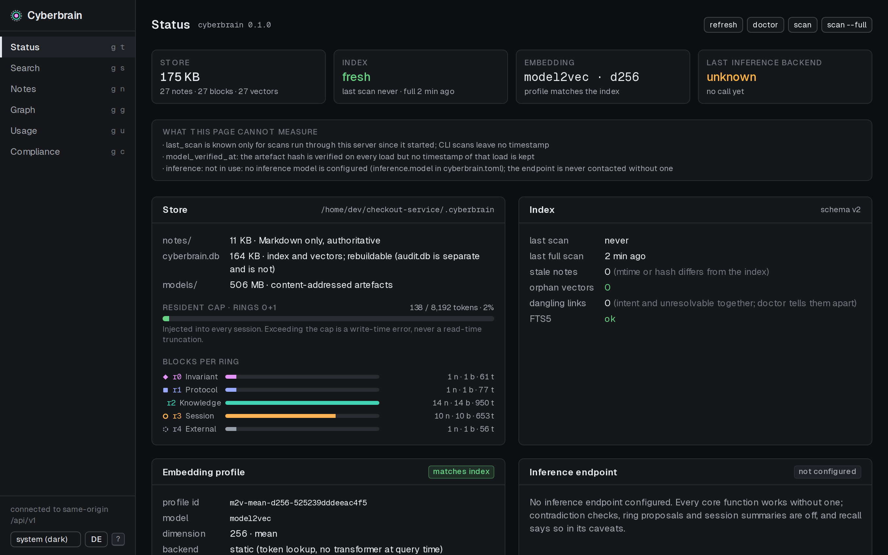
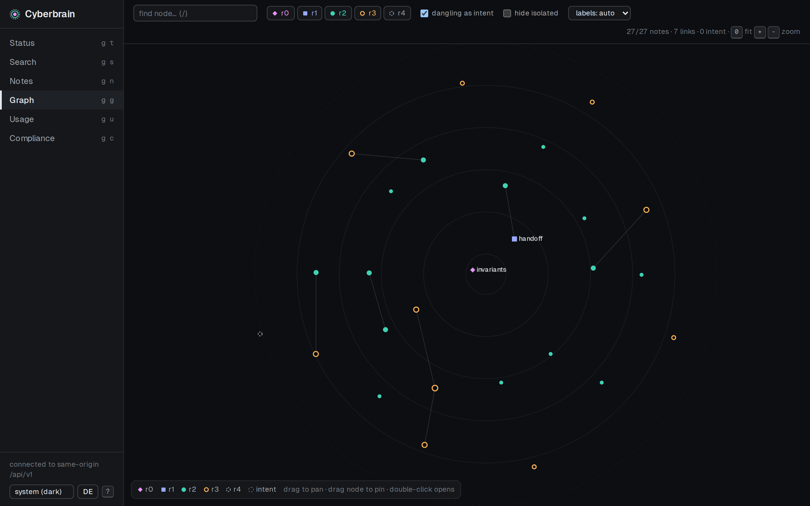
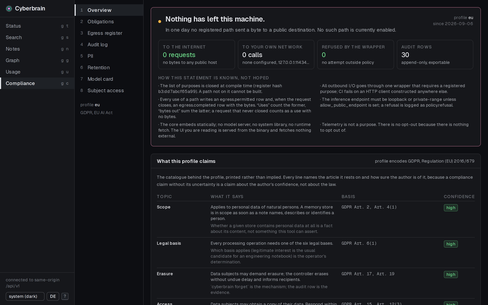

<div align="center">


# Cyberbrain

**Cited, trust-tiered, local-first memory for AI coding agents.**

[](https://github.com/bassprofressor-lab/cyberbrain/actions/workflows/ci.yml)
[](https://crates.io/crates/cyberbrain)
[](LICENSE.md)
[](rust-toolchain.toml)
[](#install)
[](#built-for-the-eu-switchable-off)

**English** · [Deutsch](README.de.md)

[Install](#install) · [Five minutes](#five-minutes) · [How it works](#how-it-works) ·
[What it needs](#what-it-needs) · [Compliance](#built-for-the-eu-switchable-off) ·
[Spec](docs/SPEC.md) · [Changelog](CHANGELOG.md) · [Contributing](CONTRIBUTING.md)

</div>

One native binary. Your notes stay plain Markdown you can read, edit and grep. Nothing
leaves the machine unless you say so, and every path that could is listed in one place you
can print.



<sub>A question in the words you would use months later. Each hit carries the ring it came
from, a citation that resolves back to the block, and its score. Screenshots are from a
demo store; the notes in them are invented.</sub>

```console
$ cyberbrain recall 'postgres data directory'
1. r2-867ef2a8cd01  r2  pg18-moves-pgdata  (100% of top)
     # PostgreSQL 18 moves PGDATA
     The official `postgres:18` image puts the data directory at
     `/var/lib/postgresql/18/docker` instead of `/var/lib/postgresql/data` ...
caveat: contradiction check skipped: no inference model is configured
```

That last line is the point as much as the hit is. The tool says what it did **not** check.

## Install

```console
$ cargo install cyberbrain
$ cyberbrain init
```

Or take a binary from the [latest release](https://github.com/bassprofressor-lab/cyberbrain/releases/latest)
and check it against the `SHA256SUMS` that ships beside it:

```console
$ sha256sum -c SHA256SUMS
$ ./cyberbrain-linux-x86_64 init
```

Linux and Windows. The binary needs nothing at runtime: no system SQLite, no OpenSSL, no
model server, no node.

### Windows without a terminal

The release also carries `cyberbrain-setup-<version>.exe`. It installs the command-line tool
and a small launcher, and puts **Cyberbrain** in the Start menu. Clicking it asks once which
project to open, starts the server on a port Windows picks, opens your browser at it, and
sits in the notification area until you quit it — right-click for the project folder, a
different project, or Quit. Closing it stops the server.

Starting it again while it is running does not give you a second icon: the second launch
opens your browser at the one already serving, and exits.

It is not signed, so SmartScreen will warn on first run: More info, then Run anyway. The
installer deliberately does not touch your `PATH`; if you want `cyberbrain` on the command
line as well, add `C:\Program Files\Cyberbrain` yourself, or `cargo install cyberbrain`.

The same installer can set up **the hub** — the one machine in a team that collects the
others' audit trail. Tick *Hub service (collector)*: it registers a Windows service, opens
the port, and makes a folder to drop the licence file into. Nothing else, and no command
prompt. On the client machines, *Connect to the company hub…* in the tray menu takes the
invitation file they were sent. The hub itself has a page at `http://localhost:7788/`: licence, seats, and
which machines are reporting. The first visit from the hub's own machine sets the
administrator password — there is no default one — and after that it opens from any desk. What a note
**says** never leaves the machine that holds it, on either side.
[`docs/HUB.md`](docs/HUB.md) has the whole picture.

<details>
<summary>Without the web page, or from a checkout</summary>

<br>

The page is compiled into the binary and ships inside the crate, so the normal install needs
no node toolchain. Leave the page out if you would rather not carry it; the CLI, the hooks,
the MCP server and the HTTP API are unaffected, and `serve` answers the API while saying the
page was not built in:

```console
$ cargo install cyberbrain --no-default-features
```

From a checkout the page is not packaged, it is built, so build it first:

```console
$ git clone https://github.com/bassprofressor-lab/cyberbrain && cd cyberbrain
$ (cd ui && npm ci && npm run build)
$ cargo install --path crates/cyberbrain
```

</details>

## Five minutes

```console
$ cyberbrain init
$ cyberbrain write --ring 2 --kind bug --name pg18-moves-pgdata --body 'what you learned'
$ cyberbrain scan
$ cyberbrain recall 'what you learned'
```

Four ways in, all from the same binary:

| | |
|---|---|
| `cyberbrain <command>` | everything is reachable from the command line, `--json` on all of it |
| `cyberbrain hook <event>` | six agent lifecycle events; measured p99 of 4 ms including process start, against a 15 ms budget |
| `cyberbrain mcp` | Model Context Protocol over stdio, for any client that speaks it |
| `cyberbrain serve` | the web page and the HTTP API, on loopback, with no authentication because it never leaves the machine |

`cyberbrain install` switches the first two on without you editing anyone's JSON: it writes
the hooks into this project's Claude Code settings and an MCP entry into the desktop clients
it finds, keeps the previous file beside the new one, and `--undo` takes it all back out. It
writes every Claude Desktop installation it finds rather than the documented path, because on
Windows those are not the same file and the wrong one fails silently.

The page has a command line of its own, so `find`, `export` and everything else without a
screen do not mean leaving for a terminal. It runs the same binary that is serving the page,
against that page's store, and hands back the same stdout, stderr and exit code.

Rings 0 and 1 are the operator's, and `cyberbrain propose` is how everyone else offers one:
the note goes to `proposals/`, outside the notes tree, so it is not indexed and `recall`
cannot return it — an unapproved invariant that an agent can retrieve is an invariant nobody
agreed to. Somebody other than the proposer accepts it with `cyberbrain review <name>
--accept`, and the audit log names both of them.

`cyberbrain serve --terminal` puts a real terminal in the page — a shell, `ssh`, an agent, in
the project's directory. It is off unless you ask for it, it needs a token the address
carries in its fragment, and it refuses a handshake from any other origin. The egress
register lists it as the one path this program does not mediate, because a register that
left it out while `ssh` is one keystroke away would be false.

Rings 0 and 1 are the operator's, and `cyberbrain propose` is how everyone else offers one:
the note goes to `proposals/`, outside the notes tree, so it is not indexed and `recall`
cannot return it — an unapproved invariant that an agent can retrieve is an invariant nobody
agreed to. Somebody other than the proposer accepts it with `cyberbrain review <name>
--accept`, and the audit log names both of them.

## How it works



Notes are the source of truth and stay yours: one Markdown file per note, in the repository,
readable without this tool. The index is derived and can be deleted at any time;
`cyberbrain scan` rebuilds it. Retrieval is lexical and semantic at once — SQLite FTS5 for
the words, a flat cosine scan over local embeddings for the meaning — fused into one ranking.

### Three properties that keep a memory worth trusting

**Cited.** Every retrieved statement carries an identifier that resolves back to the exact
source block. `cyberbrain recall --id r2-867ef2a8cd01` expands it. An answer without a
citation is a bug, not a degraded result.

**Trust-tiered.** Notes live in numbered rings. Ring 0 holds operator invariants and
overrides everything; ring 4 is unverified material. Rings 0 and 1 are injected into every
session and are size-capped so that stays affordable. When two blocks contradict, the lower
ring wins and the conflict is reported rather than silently resolved.

**Local-first.** Embeddings are computed on your machine. The core performs no network I/O
at all. Optional local inference over any OpenAI-compatible endpoint — Ollama, LM Studio,
llama.cpp, or NVIDIA PAIR spreading the work across an RTX box, a DGX Spark and an Apple M4
Mac. That endpoint may sit on another machine in your own network, so one box with a GPU can
serve a whole team: [`docs/SHARED-INFERENCE.md`](docs/SHARED-INFERENCE.md).

<details>
<summary>What the web UI shows (screenshots)</summary>

<br>

**Status** — what the store holds, what the index knows, which model is loaded, and a panel
that lists what the page *cannot* measure.



**Graph** — notes and the links between them, by ring. A link to a note that does not exist
yet is drawn as intent rather than as an error.



The page is compiled into the binary, speaks English and German, and fetches nothing from
the network.

</details>

## What it needs

A laptop. There is no large model to host here: semantic search uses **static embeddings**,
which is a table lookup and an average rather than a forward pass through a network. That is
why one CPU core is enough, and why the artefact on disk is larger than the work it does —
what takes up the space is vocabulary, not computation.

| | without a model | with the embedding model |
|---|---|---|
| one search | 10 ms | 2.3 s, most of it loading the model |
| memory | 14 MB | 1.55 GB peak while the search runs |
| full re-index | 0.7 s | 4.0 s |
| on disk | — | 507 MB for the artefact |

<sub>Measured on 2026-09-06 against a real store of 1,004 notes and 4,031 blocks, on a server
with no GPU (AMD EPYC-Milan, 12 vCPU, 23 GB RAM). Your corpus will give other numbers; the
order of magnitude is the point.</sub>

No GPU, no model server, no account, no cloud, and no download without your consent. The
only part that wants better hardware is the optional contradiction check: it needs an
inference endpoint, and on that CPU-only server one check took 126 s, over the 3 s budget —
so the hits came back unchecked, and said so.

### Semantic search needs a model, and it will tell you if it has none

Out of the box search is lexical, and every result says so in a caveat. Lexical means
literal: without a model, `postgres` does not find `PostgreSQL`, and the words you search
for are the words that have to be in the paragraph. To turn on semantic search, place a
model2vec artefact — `model.safetensors`, `tokenizer.json` and a `manifest.json` carrying
the blake3 digest of each — under `<store>/models/model2vec`. Nothing is downloaded on your
behalf unless you set `embedding.model_source` and `embedding.model_download_consent` in the
config, and even then it happens once, through the one registered outbound path.

## Built for the EU, switchable off



<sub>The headline is computed from the egress register, not typed in. Below it, what the
active profile claims the law says — with the article each line rests on and how sure the
author is of it.</sub>

Compliance is a subsystem, not a section in the docs. `cyberbrain policy egress` prints
every path by which bytes can leave the machine, what each carries, and whether it is on.
Today that list has two entries and ends with "Telemetry does not exist."

- **Erasure that erases** (GDPR Art. 17): `cyberbrain forget` removes the note, its blocks,
  its vectors, its index rows and its derivatives in one transaction, and prints what went.
- **Subject access** (Art. 15): `cyberbrain policy subject <identifier>` returns everything
  stored about it, with citations.
- **A PII check before a note is written**, holding the write for your decision rather than
  redacting behind your back.
- **An append-only audit log** with a blake3 hash chain, and a `verify` that names the first
  altered row and exits non-zero.
- **Retention** per note, applied on request and never silently in the background.
- **An obligation catalogue**: `cyberbrain policy obligations` prints what the active profile
  claims the law requires, each line with its article and a confidence.

`policy.profile` is `eu`, `ch` or `off`. Switzerland is a separate profile rather than "EU
minus", because the revised FADP differs in substance and folding them together produces
claims that are wrong in one of the two countries. Nothing below high confidence drives
behaviour.

## Status

**v0.3.0, and young.** 574 tests, seven crates on crates.io plus the Windows launcher,
clippy and rustfmt clean. Binaries for Linux and Windows on the release page, and an
installer beside them. It has been run against one operator's real corpus — 1,086 notes
across five projects — and not much else. Expect rough edges, report them.

The Windows side is the newest part and the least worn in: CI builds the launcher, the hub
service and the installer, packages them and runs the store through the binary it ships, but
none of it had been installed on anyone's desktop or registered on anyone's server when 0.3.0
went out. The service code cannot be exercised anywhere but Windows, so it is compiled and
reviewed rather than run. If it misbehaves on yours, that is worth an issue.

Cyberbrain is an original work. It shares no source code with any other memory tool; §0 of
[`docs/SPEC.md`](docs/SPEC.md) records the boundary it was built under, and the commit
history documents it decision by decision.

<details>
<summary>The seven crates</summary>

<br>

| crate | what it is |
|---|---|
| [`cyberbrain`](https://crates.io/crates/cyberbrain) | the binary: CLI, hooks, MCP server, HTTP API and the web page |
| [`cyberbrain-core`](https://crates.io/crates/cyberbrain-core) | store, notes, rings, config, the types everything else agrees on |
| [`cyberbrain-index`](https://crates.io/crates/cyberbrain-index) | the disposable index: FTS5, vectors, hybrid retrieval |
| [`cyberbrain-embed`](https://crates.io/crates/cyberbrain-embed) | static embeddings, loaded from a hash-verified artefact |
| [`cyberbrain-code`](https://crates.io/crates/cyberbrain-code) | the code index behind `cyberbrain find` |
| [`cyberbrain-llm`](https://crates.io/crates/cyberbrain-llm) | the optional OpenAI-compatible client |
| [`cyberbrain-policy`](https://crates.io/crates/cyberbrain-policy) | egress register, audit chain, PII gate, profiles, obligations |

</details>

## Contributing and security

[`CONTRIBUTING.md`](CONTRIBUTING.md) before the first pull request: the clean-room rule in
SPEC §0 binds contributors, and a contribution that breaks it breaks the provenance claim
above retroactively. Vulnerabilities go through [`SECURITY.md`](SECURITY.md), not a public
issue.

## Licence

[FSL-1.1-ALv2](LICENSE.md). Use it for anything except building a competing product, and
each release becomes Apache-2.0 two years after it ships. Copyright 2026 Krynex Labs.
